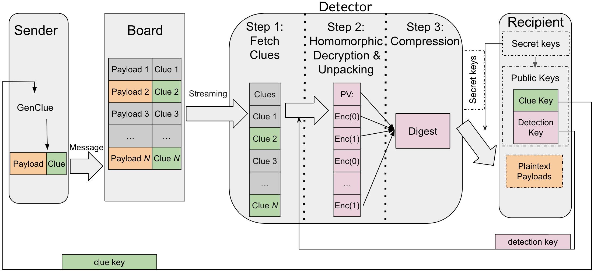
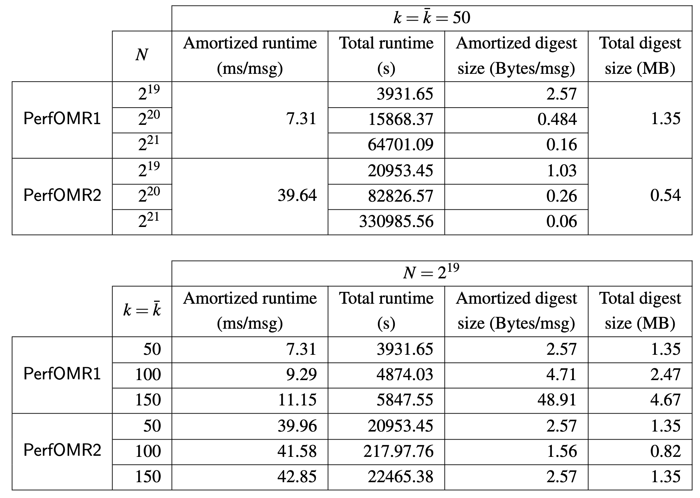

# PerfOMR (Oblivious Message Retrieval): proof of concept C++ implementation for OMR with Reduced Communication and Computation


### Abstract:
Anonymous message delivery systems, such as private messaging services and privacypreserving payment systems, need a mechanism for recipients to retrieve the messages addressed to them, without leaking metadata or letting their messages be linked. Recipients could download all posted messages and scan for those addressed to them, but communication and computation costs are excessive at scale.

We show how untrusted servers can detect messages on behalf of recipients, and summarize these into a compact encrypted digest that recipients can easily decrypt. These servers operate obliviously and do not learn anything about which messages are addressed to which recipients. Privacy, soundness, and completeness hold even if everyone but the recipient is adversarial and colluding (unlike in prior schemes), and are post-quantum secure.

Our starting point is an asymptotically-efficient approach, using Fully Homomorphic Encryption and homomorphically-encoded Sparse Random Linear Codes. We then address the concrete performance using a bespoke tailoring of lattice-based cryptographic components, alongside various algebraic and algorithmic optimizations. This reduces the digest size to a few bits per message scanned. Concretely, the servers’ cost is a couple of USD per million messages scanned, and the resulting digests can be decoded by recipients in under 20ms. However, this initial approach exhibits significant costs in computation per message scanned (109ms), as well as in the size of the associated messages (1kB overhead) and public keys (132kB).

We thus constructs more efficient OMR schemes, by replacing the LWE-based clue encryption of prior works with a Ring-LWE variant, and utilizing the resulting flexibility to improve several components of the scheme.  We thus devise, analyze, and benchmark two protocols:

The first protocol focuses on improving the detector runtime, using a new retrieval circuit that can be homomorphically evaluated more efficiently. Concretely, it takes only ~6.6ms per message scanned, 17x faster than the prior work.

The second protocol focuses on reducing the communication costs, by designing a different homomorphic decryption circuit that allows the parameter of the Ring-LWE encryption to be set such that the public key size is about 200x smaller than the prior work, and the message size is about 1.7x smaller. The runtime of this second construction is ~60ms per message, still ~2x faster than prior works.

Our schemes can thus practically attain the strongest form of receiver privacy for current applications such as privacy-preserving cryptocurrencies.


## License
The OMR library is developed by [Zeyu (Thomas) Liu](https://zeyuthomasliu.github.io/), [Eran Tromer](https://www.tau.ac.il/~tromer/) and [Yunhao Wang](https://wyunhao.github.io/), and is released under the MIT License (see the LICENSE file).


## Model Overview

The following diagram demonstrates the main components of OMR:



Here, we also briefly summarize the high-level scheme notions as below, where more details are provided in Section 3.3 and Section 4 in PerfOMR.
In our system, we have a bulletin board (or board), denoted *BB*, that is publicly available contatining *N* messages. Each message is sent from some sender and is addressed to some recipient(s), whose identities are supposed to remain private.

A message consists of a pair (*xi*, *ci*) where *xi* is the message payload to convey, and *ci* is a clue string which helps notify the intended recipient (and only them) that the message is addressed to them.

To generate the clue, the sender grabs the target recipient's *clue key*.

At any time, any potential recipient *p* may want to retrieve the messages in *BB* that are addressed to them. We call these messages pertinent (to *p*), and the rest are impertinent.

A server, called a detector, helps the recipient *p* detect which message indices in *BB* are pertinent to them, or retrieve the payloads of the pertinent messages. This is done obliviously: even a malicious detector learns nothing about which messages are pertinent. The recipient gives the detector their detection key and a bound *ḱ* on the number of pertinent messages they expect to receive. The detector then accumulates all of the pertinent messages in *BB* into string *M*, called the digest, and sends it to the recipient *p*.

The recipient *p* processes *M* to recover all of the pertinent messages with high probability, assuming a semi-honest detector and that the number of pertinent messages did not exceed *ḱ*.

This code implements PerfOMR schemes (PerfOMR1 in sec 5 and PerfOMR in sec 6) described in the submitted PerfOMR paper, which is based on the OMR described in the [OMR paper](https://eprint.iacr.org/2021/1256.pdf).


## What's in the demo

### Oblivious Message Retrieval
- Obliviously identify the pertinent messages and pack all their contents into a into a single digest.
- Schemes benchmarked: OMR1p (Section 7.4) and OMR2p (Section 7.5) in [OMR](https://eprint.iacr.org/2021/1256.pdf)
- Measured: 
    - Key sizes: ~129MB
    - detector running time (1-core, with Intel-HEXL): ~0.145 sec/msg and ~0.155 sec/msg
    - detector running time (2-core, with Intel-HEXL): ~0.075 sec/msg and ~0.085 sec/msg
    - detector running time (4-core, with Intel-HEXL): ~0.065 sec/msg and ~0.072 sec/msg
    - detector running time (1-core, w/o  Intel-HEXL): ~0.215 sec/msg and ~0.246 sec/msg
    - detector running time (2-core, w/o  Intel-HEXL): ~0.108 sec/msg and ~0.123 sec/msg
    - detector running time (4-core, w/o  Intel-HEXL): ~0.099 sec/msg and ~0.115 sec/msg
    - recipient running time: ~0.02 sec and ~0.063 sec
    - Digest size: ~560KB


### PerfOMR: OMR with Reduced Communication and Computation
- Obliviously identify the pertinent messages and pack all their contents into a into a single digest.
- Schemes benchmarked (in PerfOMR): 
    - main scheme PerfOMR1 (Section 5.3)
    - alternative scheme PerfOMR2 (Section 6)
- Measured (with parameters in Section 7):
    - Clue sizes:
        - PerfOMR1: ~2181 Byte/msg (with v = 8)
        - PerfOMR2: ~583 Byte/msg (with v = 2)
    - Clue key sizes:
        - PerfOMR1: 2.13KB per recipient
        - PerfOMR2: 0.56KB per recipient
    - Detection key size:
        - PerfOMR1: 171 Byte
        - PerfOMR2: 140 Byte
    - Digest size:
        - PerfOMR1: 2.57 Byte/msg (with v = 8)
        - PerfOMR2: 1.03 Byte (with v = 2)
    - Recipient run time:
        - PerfOMR1: ~0.037 sec
        - PerfOMR2: ~0.02 sec
    - Detector run time:



### Parameters  
- OMR: N = 2^19 (or *N* = 500,000 padded to 2^19), k = *ḱ* = 50. Benchmark results on a Google ComputeCloudc2-standard-4instance type (4 hyperthreads of an Intel Xeon 3.10 GHz CPU with 16GB RAM) are reported in Section 10 in [OMR paper](https://eprint.iacr.org/2021/1256.pdf).

- PerfOMR: N = 2^19, 2^20, 2^21, k = *ḱ* = 50, 100, 150. Benchmark results on a Google ComputeCloudc2-standard-4instance type (4 hyperthreads of an Intel Xeon 3.10 GHz CPU with 16GB RAM) are reported in Section 7 in the submitted PerfOMR paper.


## Dependencies

The OMR library relies on the following:

- C++ build environment
- CMake build infrastructure
- [SEAL](https://github.com/microsoft/SEAL) library 3.6 or 3.7 and all its dependencies
- [PALISADE](https://gitlab.com/palisade/palisade-release) library release v1.11.2 and all its dependencies (as v1.11.2 is not publicly available anymore when this repository is made public, we use v1.11.3 in the instructions instead)
- [NTL](https://libntl.org/) library 11.4.3 and all its dependencies
- [OpenSSL](https://github.com/openssl/openssl) library on branch OpenSSL_1_1_1-stable
- (Optional) [HEXL](https://github.com/intel/hexl) library 1.2.3

### Scripts to install the dependencies and build the binary
Notice that the following instructions are based on installation steps on a Ubuntu 20.04 LTS.
```
# If permission required, please add sudo before the commands as needed

sudo apt-get update && sudo apt-get install build-essential # if needed
sudo apt-get install autoconf # if no autoconf
sudo apt-get install cmake # if no cmake
sudo apt-get install libgmp3-dev # if no gmp
sudo apt-get install libntl-dev=11.4.3-1build1 # if no ntl
sudo apt-get install unzip # if no unzip

OMRDIR=~/OMR   # change build_path to where you want the dependency libraries installed
mkdir -p $OMRDIR

# Now put PERFOMR_code.zip file is in ~/OMR
# For example, if using GCP instance
# Upload PERFOMR_code.zip and then do: mv PERFOMR_code.zip ~/OMR
cd $OMRDIR && unzip PERFOMR_code.zip -d ObliviousMessageRetrieval
LIBDIR=$OMRDIR/ObliviousMessageRetrieval/build

cd $OMRDIR && git clone -b v1.11.3 https://gitlab.com/palisade/palisade-release
cd palisade-release
mkdir build
cd build
cmake .. -DCMAKE_INSTALL_PREFIX=$LIBDIR
make
sudo make install

# Old OpenSSL used for plain AES function without EVP abstraction
cd $OMRDIR && git clone -b OpenSSL_1_1_1-stable https://github.com/openssl/openssl
cd openssl
./config
make
sudo make install

# Optional
cd $OMRDIR && git clone --branch 1.2.3 https://github.com/intel/hexl
cd hexl
cmake -S . -B build -DCMAKE_INSTALL_PREFIX=$LIBDIR
cmake --build build
sudo cmake --install build

cd $OMRDIR && git clone https://github.com/microsoft/SEAL
cd SEAL
cmake -S . -B build -DCMAKE_INSTALL_PREFIX=$LIBDIR \
-DSEAL_USE_INTEL_HEXL=ON 
cmake --build build
sudo cmake --install build

cd $OMRDIR/ObliviousMessageRetrieval/build
mkdir ../data
mkdir ../data/payloads
mkdir ../data/clues
mkdir ../data/cluePoly
mkdir ../data/processedCM
sudo cmake .. -DCMAKE_PREFIX_PATH=$LIBDIR
sudo make
```

### To Run

```
cd $LIBDIR
# to run our main PerfOMR construction: for example, ./OMRdemos perfomr 2 32768 50
sudo ./OMRdemos perfomr <number_of_bundled_msgs> <number_of_transactions> <number_of_pert_msgs>

```
