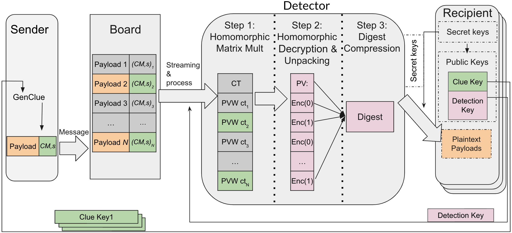
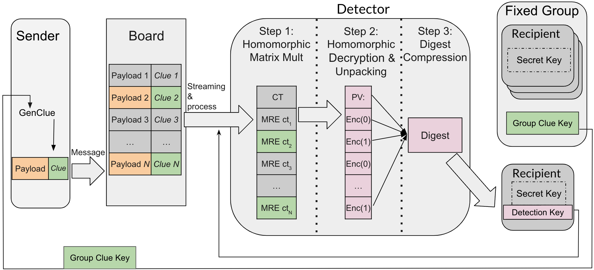
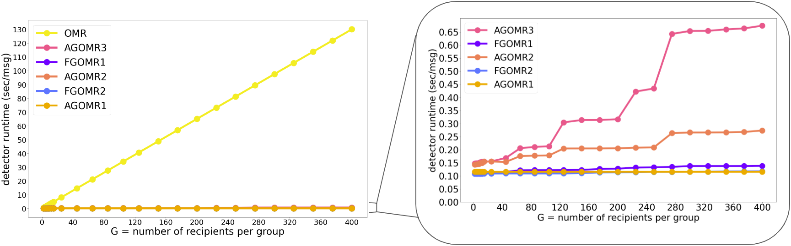

# Group Oblivious Message Retrieval: proof of concept C++ implementation for GOMR


### Abstract:
Anonymous message delivery, as in private communication and privacy-preserving blockchain applications, ought to protect recipient metadata: a message should not be inadvertently linkable to its destination.
But in this case, how can messages be delivered to each recipient, without every recipient scanning all the messages? Recent work constructed Oblivious Message Retrieval (OMR) protocols that outsource this job to untrusted servers in a privacy-preserving manner.

We consider the case of group messaging, where each message may have multiple recipients (e.g., in a group chat or blockchain transaction). A direct use of prior OMR protocols in the group setting increases the servers' work linearly in the group size, rendering it prohibitively costly for large groups.

We thus devise new protocols where the servers' cost grows very slowly with the group size, while recipients' cost is low and independent of the group size. Our approach uses Fully Homomorphic Encryption and other lattice-based techniques, building on and improving on prior work. The efficient handling of groups is attained by encoding multiple recipient-specific clues into a single polynomial or multilinear function that can be efficiently evaluated under FHE, and via preprocessing and amortization techniques.

We formally study several variants of Group Oblivious Message Retrieval (GOMR), and describe corresponding GOMR protocols. Our implementation and benchmarks show, for parameters of interest, cost reductions of orders of magnitude compared to prior schemes. For example, the servers' cost is $3.36 per million messages scanned, where each message may address up to 15 recipients.


## Overview
The following diagram demonstrates the main components of OMR:


We study two models with respect to GOMR,
which differ in how groups are formed, motivated by different applications:

The first flavor is the Ad-hoc GOMR (AGOMR), which allows the senders to send messages to a group of recipients chosen arbitrarily.
This suits cases such as messaging protocols (e.g., WhatsApp Broadcast Lists)
that let a message be addressed to any set of recipients chosen on the fly, or blockchains where transactions may have many recipients chosen arbitrarily.

We realize AGOMR using multi-linear function encoding together with other techniques. The detector uses this encoding to homomorphically recover a PVW ciphertext (Step 1 in the following diagram) and proceeds as in OMR (Step 2 and Step 3 in the OMR and AGOMR diagrams).


The second flavor is Fixed GOMR (FGOMR), where groups are pre-formed by their members and then addressed collectively.
This suits applications with a notion of persistent groups, such as mailing lists or
group chats.
It also suits blockchains applications in which transactions need to be visible to a set of parties in addition to the recipient (e.g., auditors or jurisdictional law enforcement).
The FGOMR setting is a special case of AGOMR, where having pre-formed groups FGOMR allows for more efficient constructions,
and a stronger Denial-of-Service property (two honest recipients cannot be spammed jointly if they did not agree to join the same group).

We realize FGOMR by replacing the PVW protocols with a key-private Multi-Recipient Encryption (MRE) scheme we construct in the paper. The detector homomorphically decrypts the MRE ciphertexts (Step 1 and Step 2 in the following diagram) and proceeds as in OMR (Step 3 in the OMR and FGOMR diagrams).




### Model Overview (Section 4.1 in [OMR](https://eprint.iacr.org/2021/1256.pdf), and Section 2.1 in [GOMR](https://eprint.iacr.org/2023/534.pdf))
In our system, we have a bulletin board (or board), denoted *BB*, that is publicly available contatining *N* messages. Each message is sent from some sender and is addressed to some recipient(s), whose identities are supposed to remain private.

A message consists of a pair (*xi*, *ci*) where *xi* is the message payload to convey, and *ci* is a clue string which helps notify the intended recipient (and only them) that the message is addressed to them.

In OMR, to generate the clue, the sender grabs the target recipient's *clue key*. In GOMR, the sender uses all the individual *clue keys* of the intended recipients, or alternatively, a *group clue key* jointly generated by the intended group of recipients. *Clue keys*, or *group clue keys*, are assumed to be published or otherwise communicated by some authenticated channels (whose details are
outside our scope).

At any time, any potential recipient *p* may want to retrieve the messages in *BB* that are addressed to them. We call these messages pertinent (to *p*), and the rest are impertinent.

A server, called a detector, helps the recipient *p* detect which message indices in *BB* are pertinent to them, or retrieve the payloads of the pertinent messages. This is done obliviously: even a malicious detector learns nothing about which messages are pertinent. The recipient gives the detector their detection key and a bound *ḱ* on the number of pertinent messages they expect to receive. The detector then accumulates all of the pertinent messages in *BB* into string *M*, called the digest, and sends it to the recipient *p*.

The recipient *p* processes *M* to recover all of the pertinent messages with high probability, assuming a semi-honest detector and that the number of pertinent messages did not exceed *ḱ*.

## What's in the demo

### Group Oblivious Message Retrieval
- Obliviously identify the pertinent messages that are addressed to a group of recipients and pack all their contents into a into a single digest, which will be sent to one of the recipients inside the intended groups.
- Schemes benchmarked (in [GOMR](https://eprint.iacr.org/2023/534.pdf)): 
    - main schemes AGOMR3 (Section 6.2) (which is GOMR2_ObliviousMultiplexer_BFV in the code) and FGOMR1 (Section 7.4) (which is GOMR2_FG in the code)
    - their corresponding weak version AGOMR2 (Remark 6.2) (which is GOMR2_ObliviousMultiplexer_BFV in the weak branch) and FGOMR2 (Remark 7.4) (which is GOMR2_FG in the weak branch)
- Measured: 
    - Clue sizes (with group size = 15):
        - AGOMR: ~15300 Byte/msg
        - FGOMR: ~1100 Byte/msg
    - Clue key sizes (with group size = 15):
        - AGOMR: 133K per recipient
        - FGOMR: 1.56M per group
    - Detection key size (with group size = 15): ~140M
    - Digest size: ~35 Byte/msg
    - Recipient run time: ~0.02 sec
    - Detector run time:



### Parameters 
- GOMR:  N = 2^15 (or *N* = 32,768), P = 2^60, G' = G+4, k = *ḱ* = 50, other detailed parameters please refer to our paper. Benchmark results for AGOMR with grou size ≥45, we use e8-highmem-64 instance, 64GB RAM (with a 128GB balanced disk), otherwise, we use e2-standard-2 instance type with 8GB RAM. Note that the runtime of the instance e8-highmem-64 is roughly the same as e2-standard-2. Detailed performance report can be found in Section 9 in [GOMR paper](https://eprint.iacr.org/2023/534.pdf).

## Dependencies

The OMR library relies on the following:

- C++ build environment
- CMake build infrastructure
- [SEAL](https://github.com/microsoft/SEAL) library 3.6 or 3.7 and all its dependencies
- [PALISADE](https://gitlab.com/palisade/palisade-release) library release v1.11.2 and all its dependencies (as v1.11.2 is not publicly available anymore when this repository is made public, we use v1.11.3 in the instructions instead)
- [NTL](https://libntl.org/) library 11.4.3 and all its dependencies
- [OpenSSL](https://github.com/openssl/openssl) library on branch OpenSSL_1_1_1-stable
- (Optional) [HEXL](https://github.com/intel/hexl) library 1.2.3

### Scripts to install the dependencies and build the binary
```
LIBDIR=~/ObliviousMessageRetrieval   # change to you want the dependency libraries installed

sudo apt-get install autoconf # if no autoconf
sudo apt-get install cmake # if no cmake
sudo apt-get install libgmp3-dev # if no gmp
sudo apt-get install libntl-dev=11.4.3-1build1 # if no ntl

git clone -b v1.11.3 https://gitlab.com/palisade/palisade-release
cd palisade-release
mkdir build
cd build
cmake .. -DCMAKE_INSTALL_PREFIX=$LIBDIR
make -j
make install

git clone -b OpenSSL_1_1_1-stable https://github.com/openssl/openssl
cd openssl
./configure
make
sudo make install

# Optional
git clone --branch 1.2.3 https://github.com/intel/hexl
cd hexl
cmake -S . -B build -DCMAKE_INSTALL_PREFIX=$LIBDIR
cmake --build build
cmake --install build

git clone https://github.com/microsoft/SEAL
cd SEAL
cmake -S . -B build -DCMAKE_INSTALL_PREFIX=$LIBDIR \
-DSEAL_USE_INTEL_HEXL=ON 

cmake --build build
cmake --install build

git clone https://github.com/ObliviousMessageRetrieval/ObliviousMessageRetrieval
cd ObliviousMessageRetrieval 
mkdir build
cd build
mkdir ../data
mkdir ../data/payloads
mkdir ../data/clues
mkdir ../data/cluePoly
mkdir ../data/processedCM
cmake .. -DCMAKE_PREFIX_PATH=$LIBDIR
make
```

### To Run

```
cd ~/ObliviousMessageRetrieval/build
./OMRdemos
# to run our main AGOMR construction, choose 25
# to run our main FGOMR construction, choose 31

# to change the group size, modify line 22 with the new party size in include/global.h
# and then modify line 25 with the corresponding id size (for AGOMR) or line 26 with partial size for the shared secret key (for FGOMR) in include/global.h
# use the following formula to calculate the id size or partial size:
# floor((60 * group_size + 128) / 16 + group_size + 1)
#(for example, with group size = 150, id_size = 722)
```